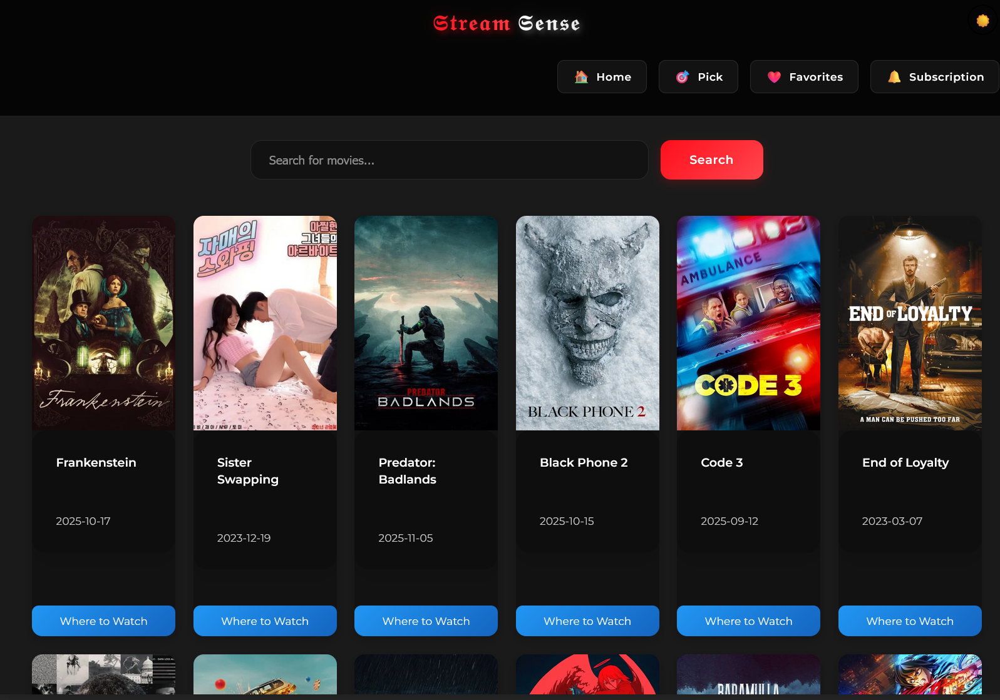

````markdown
# Streamsense

[Live Demo](https://Ayush-Chechi.github.io/Streamsense) • [Actions](https://github.com/Ayush-Chechi/Streamsense/actions)

A lightweight React app to **discover movies and where to stream them**.

---

## Screenshots

| Homepage | Movie Details |
|----------|---------------|
|  |  |

---

## Features

- Browse & search movies
- View details, trailers, and streaming platforms
- Save favorites and get recommendations
- Light / Dark mode

---

## Tech Stack

- React + Vite  
- React Router  
- CSS (in `src/css/`)  
- APIs: TMDB, OMDb, YouTube, Watchmode  
- Deployment: GitHub Pages (Actions or `gh-pages`)

---

## Quick Start

**Requirements:** Node.js 18+ and npm

```powershell
cd C:\Users\ayush\Desktop\Projects\Streamsense
npm install
npm run dev
````

Open in browser: `http://localhost:5173/Streamsense/`

---

## Build & Deploy

Build locally:

```powershell
npm run build
```

Deploy automatically via GitHub Actions on push to `main`, or manually with:

```powershell
npx gh-pages -d dist
```

---

## Project Structure

```
Streamsense/
├── public/                  # static assets/screenshots
├── src/
│   ├── components/          # React components
│   ├── pages/               # route pages (Home, Details, Favorites)
│   ├── services/            # API helpers
│   └── css/                 # styles
├── .github/workflows/       # Actions workflow for Pages
├── index.html
├── package.json
├── vite.config.js
└── README.md
```

---

## Notes

* Ensure `vite.config.js` base and React Router `basename` match `/Streamsense/` for GitHub Pages routing.
* If CI fails on `npm ci`, run `npm install` and commit `package-lock.json`.

---

## Contributing & License

Contributions welcome. Educational use only.
